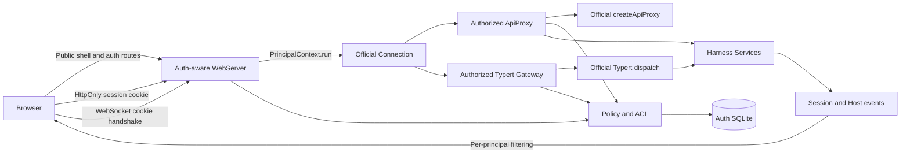

# DeepSeek Harness 登录与权限管理插件落地方案

> 暂定仓库名：`ds-auths-plugin`
>
> 文档状态：架构定案，可进入实现
>
> 调研基线：DeepSeek Harness `47f943859bef60e4160492346772ded9b24f765a`，版本 `0.1.0-rc.5`
>
> 更新日期：2026-08-17

## 1. 执行结论

本项目应作为独立 GitHub/npm 仓库交付，不 fork、不修改 DeepSeek Harness 源码，不在安装时改写 `node_modules`。用户通过标准命令安装 Bundle：

```bash
dsh plugin --profile web add ds-auths-plugin
```

插件由一个 npm 包提供四个 Host 入口和一个 Browser 入口：

- `ds-auths-plugin`：用户、身份、会话、角色、策略、ACL、审计和数据库。
- `ds-auths-plugin/webserver`：替换官方 `id: webserver`，保持 `ctx.webServer` 契约不变，在 HTTP 路由和 WebSocket upgrade 分发前统一认证。
- `ds-auths-plugin/api-proxy`：替换官方 `id: api-gateway`，复用官方 `createApiProxy()`，增加 Legacy RPC 的 RBAC、资源 ACL、列表与事件过滤。
- `ds-auths-plugin/typert-gateway`：替换官方 `id: typert-gateway`，继承官方 Gateway 并在公开 `invoke()` 边界执行 Typert endpoint 策略。
- `ds-auths-plugin/client`：通过 `dsh.client` 自动加载，提供登录遮罩、首次初始化、用户菜单和权限管理台。

最终选型不是“只加一个登录页面”，也不是“在 `/api` 上再注册一个 prefix”。安全边界必须覆盖 HTTP、WebSocket、Legacy RPC、Typert RPC、下载端点和第三方插件路由。

## 2. 已验证事实

官方仓库为 <https://github.com/deepseek-ai/deepseek-harness>。本地代码已同步到提交 `47f943859bef60e4160492346772ded9b24f765a`。

官方当前能力与缺口如下：

| 项目 | 已验证结论 |
|---|---|
| 插件体系 | Profile、Bundle、Patch、Host/Browser 双端插件均为官方扩展方式 |
| Web Server | 提供 route、upgrade、fallback、index tap，没有全局 middleware seam |
| 当前信任栅栏 | 防 DNS rebinding、Host 欺骗和跨站简单请求，不是用户认证 |
| 用户身份 | 当前请求、WebSocket 和 Agent lookup 中均没有登录用户 Principal |
| `/api` prefix | 已被官方 Connection 占用，重复注册会抛错 |
| `/api` interceptor | 只允许一个，已被 Typert Gateway 占用，不能再叠加认证 interceptor |
| WebSocket | `/api/events.mux` 与 `/api/events.host` 各有唯一 upgrade owner |
| Browser Transport | 使用同源 `fetch` 和原生 `WebSocket`，天然适合 HttpOnly Cookie |
| Mux 事件 | 每个连接默认订阅全部 attached sessions，并接收全部 session events |
| Host 事件 | 每个连接默认接收全局 session、workspace、settings、credentials 等事件 |
| Session 列表 | `session.list` 当前返回进程内和持久化中的全部可服务会话 |
| Workspace 列表 | `workspace.list` 当前返回注册表内全部工作区和全局归档集合 |
| Storage Domain | 没有跨表事务、二级索引和复合键，不适合直接承载认证关系模型 |
| UI Slot | 全局门禁应注册 `shell.overlay`，禁止注册并遮蔽 `root` |

现有 Agent 权限预设解决的是“Agent 能做什么”，用户 RBAC 解决的是“哪个人能登录并调用什么”。两者必须同时约束，不能互相替代。

## 3. 目标与非目标

### 3.1 目标

- 标准 Bundle 安装、升级、卸载，不修改 Harness 文件。
- 支持首次管理员初始化、本地密码、OIDC 和可信代理身份。
- 使用服务器端可撤销会话和 HttpOnly Cookie。
- 支持用户、角色、权限、资源 ACL、在线会话和审计日志。
- HTTP 与 WebSocket 使用同一身份和策略模型。
- 对 Legacy RPC 与 Typert RPC 均执行 endpoint 权限检查。
- 对工作区、会话、历史、附件、导出、搜索和事件流执行资源过滤。
- UI 现代、美观、响应式、组件化并复用 Harness 设计令牌。
- 明确共享实例与严格多租户的安全边界。

### 3.2 非目标

- 不修改 DeepSeek Harness 官方源码或构建产物。
- 不把 Agent sandbox/approval 包装成用户 RBAC。
- 不把浏览器返回的个人资料当作可信认证凭据。
- 不承诺一个共享 Node 进程等同于 OS/容器级租户隔离。
- 首版不自行终止 TLS，生产环境由受信任反向代理或平台入口提供 HTTPS。

## 4. 支持等级

| 等级 | 名称 | 能力 | 推荐场景 |
|---|---|---|---|
| L1 | 共享团队模式 | 登录、服务器端会话、endpoint RBAC、审计；资源默认团队共享 | 内网小团队、首个可用版本 |
| L2 | 共享进程 ACL 模式 | 增加 workspace/session ACL、列表过滤、事件过滤、下载过滤 | 受控团队协作，需完整安全测试 |
| L3 | 强隔离多租户模式 | 每租户独立 DSH Process、`DSH_HOME`、工作目录和凭据，认证路由层只做调度 | 互联网服务、互不信任用户 |

首个正式版本交付 L1，并把 L2 作为可启用的实验能力。只有 L3 可以宣称强租户隔离，因为同一 Harness 进程中的 Agent、工具、第三方插件和宿主文件系统仍共享信任域。

## 5. 总体架构



请求级身份通过 Node `AsyncLocalStorage<Principal>` 保存。WebServer 在进入任何受保护 handler 前建立上下文；ApiProxy 和 Typert Gateway 从该上下文读取 Principal，不允许业务代码信任客户端提交的 `userId`、角色或权限。

```ts
interface Principal {
  userId: string
  sessionId: string
  username: string
  displayName: string
  roles: readonly string[]
  permissions: ReadonlySet<string>
  authVersion: number
  policyVersion: number
}

interface AuthorizationInput {
  principal: Principal
  action: string
  resource?: { type: 'workspace' | 'session'; id: string }
  endpoint: string
}
```

## 6. 为什么替换 WebServer Adapter

普通插件无法在官方 WebServer 上注册全局前置中间件。相同 `(kind, path)` 的 HTTP route 会冲突，相同 WebSocket path 也只有一个 owner。因此，认证不能通过新增 `/api` prefix 或新增 upgrade route 实现。

替换 `id: webserver` 的优势如下：

- 在 exact/prefix/fallback 匹配前统一认证。
- 在 WebSocket upgrade handler 前验证 Cookie、Origin 和会话状态。
- 继续向所有官方和第三方插件提供相同 `ctx.webServer` 接口。
- 官方 Connection、静态文件服务和插件路由无需修改。
- 直接访问 DSH 监听端口也经过认证，不存在未保护的旁路上游。
- 卸载 Bundle 后官方 `webserver` 条目自动恢复，不残留文件补丁。

认证版 Adapter 必须通过从官方 WebServer 测试移植的契约测试，覆盖重复路由、最长 prefix、fallback、index tap、upgrade、socket 清理和服务卸载。

### 6.1 路由默认策略

| 路由 | 未登录策略 |
|---|---|
| `GET /` 与 SPA fallback | 允许，仅用于加载登录 UI |
| 指纹化 `/assets/*` | 允许 |
| 精确匹配的 Browser 插件 JS/CSS | 允许 |
| `/auth/v1/bootstrap/status` | 允许，响应不泄露用户信息 |
| `/auth/v1/bootstrap/complete` | 仅未初始化状态和有效一次性令牌 |
| `/auth/v1/login`、OIDC start/callback | 允许并限速 |
| `/auth/v1/health/live` | 允许，只返回最小状态 |
| 其他 HTTP route | 默认要求认证 |
| 所有 WebSocket upgrade | 默认要求认证 |
| 未识别 route 与异常策略 | fail closed |

不能把整个 `/plugins/*` 无条件公开，只允许客户端启动所需的精确静态资源形态，避免未来插件在同一 prefix 下暴露管理接口。

## 7. ApiProxy 授权与数据过滤

认证版 `api-gateway` 使用官方公开的 `createApiProxy()` 生成原始实现，再以装饰器方式包装每个领域。它不复制 `api-proxy.ts` 的业务实现。

### 7.1 必须前置授权的方法

- 所有携带 `sessionId` 的读取、写入、控制和附件方法。
- 所有携带 `workspaceId` 的读取和写入方法。
- `session.create` 的 workspace、cwd、Agent preset 和最大 sandbox 权限。
- `session.fork` 的源会话权限和新会话 ACL 继承。
- `workspace.create` 的宿主路径范围。
- `/api/respond` 对应 approval/question 所属会话的权限。
- `session.export` 根会话和后代会话的导出权限。

### 7.2 必须过滤的返回值

- `session.list.items`：只返回 Principal 可见的会话。
- `session.search.items`：按会话 ACL 二次过滤，不允许不可见 snippet 出现在响应。
- `workspace.list.items`：只返回可见工作区。
- `workspace.list.archivedSessionIds`：只返回可见会话 id。
- `events.mux`：逐帧验证 `sessionId`，过滤 event、queue、jobs、projection、approval 和 question。
- `events.host`：过滤 session/workspace 增量，重写 order 与 archived 全量快照。
- `host/remote-event`：按事件目录授权；credentials、settings、Cordis 动态包事件默认仅管理员。

官方 mux 会向每个连接广播所有 attached session，社区实现若只过滤 `session.list` 而不改写 WebSocket 帧，仍会泄露跨用户消息。L2 上线前必须把事件过滤列为阻断性验收项。

### 7.3 新资源创建

`session.create` 由包装器预分配 `sessionId`，先在认证库写入 `provisioning` 所有权记录，再调用官方实现，成功后转为 `active`，失败则回滚。事件过滤器只把 provisioning 资源暴露给创建者。

`session.fork` 当前不支持目标 id 预分配。默认对未知新资源 fail closed，官方返回子会话 id 后立即写入继承 ACL，再通知客户端刷新。后续若官方增加目标 id 参数，可切换为与 create 相同的预登记流程。

现有 Harness 安装首次启用插件时，所有已有资源先设为 `unclaimed`，仅首个 `super_admin` 可见；管理员通过迁移向导选择团队共享或分配 owner，避免安装瞬间向普通用户泄露历史数据。

## 8. Typert Gateway 授权

官方 Typert Gateway 已占用唯一 `/api` interceptor，但它公开了 `invoke(request)`，内部 RPC 适配器会动态调用 `this.invoke()`。认证插件替换 `id: typert-gateway`，继承官方 `TypertGatewayService` 并覆写 `invoke()`：

```ts
class AuthorizedTypertGateway extends TypertGatewayService {
  override async invoke(request: InvokeRemoteRequest): Promise<unknown> {
    const principal = principalContext.require()
    await policy.authorizeTypert(principal, request)
    return super.invoke(request)
  }
}
```

策略在官方 descriptor lookup、Context lookup 和业务方法调用前执行。每个 endpoint 使用显式策略描述，不做不可靠的“递归找任意 sessionId”猜测。

未知 Typert endpoint 的默认策略为 `deny`。兼容模式可配置为 `authenticated`，但生产默认不启用；新插件安装后应通过管理台把 endpoint 加入策略目录。

## 9. Bundle 与仓库结构

```text
ds-auths-plugin/
├── package.json
├── cordis.patch.yml
├── tsconfig.json
├── scripts/
│   ├── build.mjs
│   ├── preview.mjs
│   └── verify-preview.mjs
├── src/
│   ├── index.ts
│   ├── webserver.ts
│   ├── api-proxy.ts
│   ├── typert-gateway.ts
│   ├── principal-context.ts
│   ├── auth/
│   ├── policy/
│   ├── persistence/
│   ├── providers/
│   ├── audit/
│   └── client/
├── tests/
└── lib/
```

可复用组件只实现一次：策略目录以数据声明驱动 Legacy RPC、Typert RPC 和 UI 权限提示；表格、筛选器、状态徽章、确认弹窗、空状态、分页和表单字段均使用共享组件。

### 9.1 package.json 关键声明

```json
{
  "name": "ds-auths-plugin",
  "type": "module",
  "main": "./lib/index.js",
  "exports": {
    ".": "./lib/index.js",
    "./webserver": "./lib/webserver.js",
    "./api-proxy": "./lib/api-proxy.js",
    "./typert-gateway": "./lib/typert-gateway.js",
    "./client": "./lib/client.js",
    "./package.json": "./package.json"
  },
  "files": ["lib", "cordis.patch.yml"],
  "dsh": {
    "bundle": { "patch": "./cordis.patch.yml" },
    "client": {
      "platform": "web",
      "immediately": true,
      "inject": [
        "@deepseek-ai/dsh-client-runtime",
        "@deepseek-ai/dsh-client-ui-slots",
        "@deepseek-ai/dsh-client-locale"
      ]
    }
  }
}
```

首个可运行实现以已发布的 DSH `0.1.0-rc.6` 组合验证，不使用宽泛的版本范围；每个 DSH RC 发布对应插件版本和兼容矩阵。

### 9.2 Patch 示例

Patch 覆盖整项而不是深度合并，因此必须重述官方条目中需要保留的字段：

```yaml
- insert:
    - id: dsh-auth
      name: ds-auths-plugin

- id: typert-gateway
  name: ds-auths-plugin/typert-gateway

- id: api-gateway
  name: ds-auths-plugin/api-proxy

- id: webserver
  name: ds-auths-plugin/webserver
  inject: [webStartup]
  config:
    host: !!js ctx.webStartup.host ?? '127.0.0.1'
    port: !!js ctx.webStartup.port ?? 3080

- id: connection
  name: '@deepseek-ai/dsh-client-connection'
  inject: [webRuntime]
  config:
    trustedHosts: !!js ctx.webRuntime.trustedHosts
```

`connection` 行在示例中显式重述，目的是锁定并验证官方 Connection 未被替换。实际发布前必须以目标 DSH 版本的 `--dump-config` 快照测试最终配置树。

## 10. 认证模型

### 10.1 会话

- 登录成功后生成 256-bit 随机 opaque session id，只把 SHA-256 哈希存入数据库。
- Cookie 默认 `HttpOnly`、`SameSite=Lax`、`Path=/`，HTTPS 下强制 `Secure`，不设置 `Domain`。
- 登录、提权和密码变更后轮换 session id，防止 session fixation。
- 支持 idle timeout、absolute timeout、单设备注销、全部设备注销和管理员撤销。
- 用户 `auth_version` 或角色 `policy_version` 变化时，旧会话立即失效或强制重新加载权限。
- 活跃 WebSocket 绑定 session id；撤销会话时服务端主动关闭对应 socket。
- 不把访问令牌存入 `localStorage`、`sessionStorage` 或 URL。

### 10.2 本地密码

- 使用 Argon2id，参数随基准测试写入 hash；不使用 SHA、可逆加密或普通 HMAC 代替密码哈希。
- 密码长度 12–128，允许密码管理器生成的 Unicode 与符号。
- 不强制“大写、小写、数字、符号各一个”这类可预测组合规则；改用长度、泄露密码阻断和强度提示。
- 不存在用户也执行等成本的 dummy hash，统一登录失败文案。
- 同时按账号、IP、账号+IP 限速，指数退避并记录审计。
- 首次管理员通过一次性 bootstrap token 创建；token 只保存哈希、短期有效、用后即焚。

### 10.3 OIDC

- Authorization Code + PKCE、state、nonce、严格 redirect URI。
- 身份唯一键为 `(issuer, subject)`，不以可变 email 作为主键。
- 支持 claim 到角色的显式映射，映射规则变更写审计。
- OIDC 不可用时，本地 break-glass 管理员可选启用并受额外限速。

### 10.4 可信代理 Header

- 只接受来自配置的反向代理 IP/CIDR。
- 直连请求一律忽略身份 Header。
- 代理必须覆盖而非追加用户 Header，并可选提供 HMAC 签名或 mTLS 证明。
- Header 值只映射到已存在 identity，不允许调用方直接提交角色和权限。

### 10.5 企业资料补全

浏览器可在登录成功后调用企业内网的用户资料接口（示意）：

```text
GET /api/internal/profile
```

返回的 `EngName`、`ChnName`、`DeptNameString`、`WorkPlaceID`、`PositionName` 只用于显示资料补全。头像使用（示意）：

```text
https://example.com/photo/150/${name}.png?default_when_absent=true
```

该接口目前仅限前端调用，服务端无法验证浏览器回传值，因此这些字段不能直接授予角色、ACL 或管理员身份。只有当可信 SSO/OIDC 身份中也有可验证的 `EngName`，才能把资料与该 identity 绑定。

## 11. 权限模型

权限采用稳定字符串，不把 UI 页面名当权限名：

| 领域 | 权限 |
|---|---|
| 入口 | `harness.access` |
| 工作区 | `workspace.read`、`workspace.create`、`workspace.manage` |
| 会话 | `session.read`、`session.create`、`session.prompt`、`session.manage`、`session.export` |
| 子代理 | `subagent.read`、`subagent.prompt`、`subagent.interrupt` |
| 交互 | `approval.respond`、`question.respond` |
| 模型 | `models.read`、`models.select`、`models.discover`、`models.manage` |
| Agent 预设 | `agentPresets.read`、`agentPresets.select`、`agentPresets.manage` |
| 设置 | `settings.read`、`settings.write` |
| 凭据 | `credentials.read`、`credentials.write` |
| 插件 | `plugins.read`、`plugins.manage` |
| 宿主 | `host.browse`、`host.openPath` |
| 管理 | `users.manage`、`roles.manage`、`sessions.manage`、`audit.read` |

### 11.1 内置角色

| 能力 | super_admin | admin | operator | member | viewer |
|---|---:|---:|---:|---:|---:|
| 登录与读取授权资源 | 是 | 是 | 是 | 是 | 是 |
| 创建 workspace/session | 是 | 是 | 是 | 是 | 否 |
| Prompt、取消、队列操作 | 是 | 是 | 是 | 是 | 否 |
| 回答审批 | 是 | 是 | 是 | 可配置 | 否 |
| 管理共享资源 | 是 | 是 | 是 | 否 | 否 |
| 修改模型与设置 | 是 | 是 | 否 | 否 | 否 |
| 读写凭据 | 是 | 可配置 | 否 | 否 | 否 |
| 管理用户和角色 | 是 | 是 | 否 | 否 | 否 |
| 查看审计 | 是 | 是 | 可配置 | 否 | 否 |
| 修改 super_admin | 是 | 否 | 否 | 否 | 否 |

角色只是权限集合；授权判断始终是 `permission + resource ACL + deployment constraints` 三者同时满足。

### 11.2 RPC 映射

| Endpoint | 权限与资源规则 |
|---|---|
| `host.describe` | `harness.access` |
| `session.list/search/history/attachment` | `session.read` + session ACL；响应过滤 |
| `session.create` | `session.create` + workspace ACL + preset/sandbox 上限 |
| `session.models/selectModel` | `models.read/select` + session ACL |
| `session.rename/fork/updateQueue/cancel` | `session.manage` + session ACL |
| `session.prompt` | `session.prompt` + session ACL + 配额 |
| `session.export` | `session.export` + 根与后代 ACL |
| `workspace.list` | `workspace.read`；响应过滤 |
| `workspace.create` | `workspace.create` + 允许路径范围 |
| `workspace.rename/delete/reorder/archive` | `workspace.manage` + workspace/session ACL |
| `subagent.*` | 对应 subagent 权限 + parent/child session ACL |
| `agentPreset.list/select` | `agentPresets.read/select` |
| `agentPreset.read/copy/openDocument/remove` | `agentPresets.manage`；默认仅管理员 |
| `settings.*` | `settings.read/write`；全局配置面 |
| `credentials.*` | `credentials.read/write`；全局机密面 |
| `llm.providers/models/discoverModels` | `models.read/discover` |
| `host.pickDirectory/listDirectory/createDirectory/openPath` | `host.browse/openPath` + 路径约束 |
| `/api/respond` | `approval.respond` 或 `question.respond` + interaction 所属 session ACL |
| Typert Remote | 显式 endpoint policy；未知 endpoint 默认拒绝 |

构建时从官方 `RpcMethodMap` 和 Typert descriptor 生成“未分类 endpoint”报告；CI 中存在未分类 endpoint 即失败，防止 DSH 升级静默新增未授权入口。

## 12. Agent 权限联动

用户 RBAC 不能只隐藏按钮。插件必须为角色配置允许的最大 Agent 权限级别：

| 角色 | 默认最大 sandbox |
|---|---|
| super_admin | `danger-full-access` |
| admin | 可配置，默认 `workspace-write` |
| operator | `workspace-write` |
| member | `workspace-write` 或 `read-only` |
| viewer | 不允许启动 Agent |

需要拦截 `session.create.agentPreset`、`agentPreset.select`、权限设置写入、相关 slash command 和 approval response。共享进程中即使 API ACL 正确，允许不受限 bash 的用户仍可能读取进程可见文件；不互信租户必须使用 L3。

## 13. 数据模型

默认使用 Node `node:sqlite` 独立数据库：

```text
$DSH_HOME/auth/v1/auth.db
```

选择独立 SQLite 而非 DSH Storage Domain，是因为认证需要跨表事务、唯一约束、二级索引、会话清理和审计查询，而当前 Storage Domain 明确不提供这些能力。

| 表 | 关键字段 |
|---|---|
| `schema_migrations` | `version`、`applied_at` |
| `users` | `id`、`username_norm`、`display_name`、`email`、`status`、`password_hash`、`auth_version` |
| `identities` | `user_id`、`provider`、`issuer`、`subject`、`profile_json` |
| `roles` | `id`、`name`、`built_in`、`policy_version` |
| `permissions` | `name`、`description` |
| `role_permissions` | `role_id`、`permission_name` |
| `user_roles` | `user_id`、`role_id` |
| `auth_sessions` | `id_hash`、`user_id`、`created_at`、`last_seen_at`、`idle_expires_at`、`absolute_expires_at`、`revoked_at` |
| `resource_grants` | `resource_type`、`resource_id`、`subject_type`、`subject_id`、`action` |
| `resource_owners` | `resource_type`、`resource_id`、`owner_user_id`、`state` |
| `pending_interactions` | `rpc_id`、`session_id`、`kind`、`expires_at` |
| `bootstrap_tokens` | `token_hash`、`expires_at`、`used_at` |
| `audit_log` | actor、action、resource、decision、request id、IP 摘要、metadata、created_at |
| `auth_settings` | provider 与安全策略配置，不存明文 secret |

数据库启用 `foreign_keys=ON`、WAL、`busy_timeout` 和严格事务。文件权限在 POSIX 下设为 `0600`。密钥进入 DSH Credentials 或环境变量，不能写入审计和普通设置响应。

未来若增加外部数据库 Adapter，数据库名称必须固定为 `o90ukdlm`。

## 14. Auth HTTP API

统一响应错误：

```json
{
  "ok": false,
  "error": {
    "code": "AUTH_INVALID_CREDENTIALS",
    "message": "用户名或密码错误",
    "requestId": "..."
  }
}
```

| 方法与路径 | 访问级别 | 用途 |
|---|---|---|
| `GET /auth/v1/bootstrap/status` | Public | 是否需要初始化，不返回账号数量 |
| `POST /auth/v1/bootstrap/complete` | Public-once | 用一次性 token 创建首个管理员 |
| `POST /auth/v1/login` | Public | 本地登录，轮换 Cookie |
| `GET /auth/v1/oidc/:provider/start` | Public | 创建 state、nonce、PKCE |
| `GET /auth/v1/oidc/:provider/callback` | Public | 校验回调并创建会话 |
| `GET /auth/v1/session` | Authenticated | 当前 Principal、权限摘要和 CSRF token |
| `POST /auth/v1/logout` | Authenticated | 撤销当前会话 |
| `POST /auth/v1/logout-all` | Authenticated | 增加 auth_version 并撤销全部会话 |
| `POST /auth/v1/password/change` | Local identity | 校验当前密码后改密 |
| `GET/POST/PATCH /auth/v1/admin/users` | `users.manage` | 用户管理 |
| `GET/POST/PATCH /auth/v1/admin/roles` | `roles.manage` | 角色和权限管理 |
| `GET/POST /auth/v1/admin/grants` | `roles.manage` | 资源授权 |
| `GET/DELETE /auth/v1/admin/sessions` | `sessions.manage` | 在线会话查看与撤销 |
| `GET /auth/v1/admin/audit` | `audit.read` | 搜索、筛选、分页和导出审计 |

所有状态变更接口要求同源 Origin/Fetch Metadata 检查和 CSRF header。登录、bootstrap、OIDC callback 使用独立限速策略。

## 15. Browser UI

### 15.1 登录与初始化

Browser 包 `immediately: true`，在 `shell.overlay` 注册全屏门禁：

- 首次启动显示三步初始化向导：验证 bootstrap token、创建管理员、确认安全策略。
- 登录页使用品牌化双栏布局、渐变背景、轻量动效、密码显隐、Caps Lock 提示和加载状态。
- 支持本地密码与多个 OIDC 按钮，错误使用稳定 code 本地化。
- 会话过期弹出不可关闭的重新登录 Modal，成功后整页 reload，重建 Connection 与两个 WebSocket。
- 登录前不渲染敏感工作区、会话标题或错误详情。

### 15.2 用户入口

在官方现有可组合 Slot 中增加：

- `shell.overlay`：登录门禁、会话过期、强制改密、确认弹窗。
- `settings.general.item`：当前用户、登录方式、设备会话和退出全部设备。
- `settings.section`：独立“访问控制”管理页。
- 可用侧栏 Slot 存在时增加头像菜单；不存在时不覆盖 `root`，优雅降级到设置入口。

企业资料可显示 `ChnName`、部门、职位和头像，但 UI 明确区分“已验证身份字段”和“资料补全字段”。

### 15.3 管理台

管理台使用数据驱动 Tab 和响应式网格：

| 页面 | 交互与视觉组件 |
|---|---|
| 概览 | 指标卡、登录趋势、拒绝原因图表、风险提示、最近审计时间线 |
| 用户 | 搜索、状态/角色筛选、虚拟化表格、角色徽章、批量禁用、用户详情 Drawer |
| 角色 | 权限矩阵、全选分组、差异预览、内置角色锁定、保存确认 Modal |
| 资源访问 | Workspace/Session 树、用户/角色授权、继承来源、冲突提示 |
| 在线会话 | 设备、最近活动、IP 摘要、单会话撤销、全部撤销 |
| 审计 | 时间范围、actor/action/decision 筛选、详情 Drawer、JSON/CSV 导出 |
| 安全设置 | Provider 卡片、会话 TTL、限速、可信代理、未知 endpoint 策略 |

视觉实现使用 Harness CSS 设计令牌、CSS Modules 和共享组件，不污染全局样式。动画遵守 `prefers-reduced-motion`，完整支持键盘、焦点环、ARIA、空状态、骨架屏和移动端布局。

## 16. 安全控制

| 威胁 | 控制 |
|---|---|
| 直接访问 DSH 端口绕过网关 | 同端口替换 WebServer，不保留未认证上游 |
| Cookie 被脚本窃取 | HttpOnly、CSP、禁止 token 进入 Web Storage |
| CSRF | SameSite、Origin、Fetch Metadata、CSRF token |
| Session fixation | 登录和提权后轮换 id |
| WebSocket 绕过 | upgrade 前验证 Cookie 与 Origin，撤销时主动断开 |
| 用户枚举 | 统一错误、dummy hash、固定响应形态 |
| 暴力破解/喷洒 | 账号、IP、组合限速和指数退避 |
| 权限升级 | 服务端策略，不能信任按钮隐藏；限制 preset/sandbox/approval |
| 会话和工作区泄露 | 列表、搜索、历史、附件、下载和事件逐层过滤 |
| 第三方插件新端点 | 路由默认认证，Typert endpoint 默认 deny，CI 未分类检查 |
| Secret 泄露 | Credentials 保存，响应与审计脱敏，禁止记录请求 body |
| 策略或数据库故障 | fail closed，返回 503，不回退匿名 |
| 角色变更后旧权限 | policy version 失效、socket 重连、缓存短 TTL |
| 路径穿越 | canonical path、realpath、边界前规范化、白名单比较 |

安全响应头至少包含 `Content-Security-Policy`、`frame-ancestors 'self'`、`X-Content-Type-Options: nosniff`、合理的 `Referrer-Policy`。HSTS 仅在确认全站 HTTPS 后启用。

## 17. 配置建议

```yaml
auth:
  mode: shared-team
  database:
    driver: sqlite
    path: ${DSH_HOME}/auth/v1/auth.db
  session:
    idleTtl: 8h
    absoluteTtl: 24h
    cookieSecure: auto
  providers:
    local:
      enabled: true
    oidc: []
    trustedHeader:
      enabled: false
  policy:
    unknownEndpoint: deny
    existingResources: admin-only
  proxy:
    trustedCidrs: []
  audit:
    retentionDays: 180
```

配置 Schema 必须拒绝未知字段、无效 TTL、空 issuer、宽泛可信代理和不可写数据库路径。secret 配置只接受 Credentials 引用或环境变量引用。

## 18. 安装、升级与卸载

### 18.1 安装

```bash
dsh plugin --profile web add ds-auths-plugin@0.1.0
dsh --profile web --dump-config
npx @deepseek-ai/dsh web
```

`--dump-config` 验证以下结果：

- `webserver` 指向 `ds-auths-plugin/webserver`。
- `api-gateway` 指向 `ds-auths-plugin/api-proxy`。
- `typert-gateway` 指向 `ds-auths-plugin/typert-gateway`。
- `connection` 仍指向官方包。
- Browser client 被加入 `window.__DSH_BOOT__`。

离线安装使用预构建 tarball：

```bash
dsh plugin --profile web add ./ds-auths-plugin-0.1.0.tgz
```

不推荐直接安装 GitHub TypeScript 源码，因为 pnpm 10+ 对 `prepare`/构建脚本存在额外授权和供应链摩擦。

### 18.2 升级

- 启动前备份认证数据库并运行事务迁移。
- 迁移只前进；失败时不启动 WebServer。
- 每个插件版本声明唯一支持的 DSH RC 范围。
- CI 对目标 DSH 的配置树、WebServer 契约和 endpoint 目录做快照比较。

### 18.3 卸载

```bash
dsh plugin --profile web remove ds-auths-plugin
```

卸载只移除 Bundle，不需要恢复 `node_modules` 或官方文件。认证数据默认保留以防误删；管理员可在卸载前执行专用 purge 命令删除 `$DSH_HOME/auth/v1`。文档必须明确：移除插件会恢复官方匿名 Web 行为，不能把卸载误认为“账号仍保护实例”。

## 19. 测试计划

| 层级 | 必测内容 |
|---|---|
| Unit | Argon2、session rotation、TTL、CSRF、限速、角色展开、ACL 继承、审计脱敏 |
| WebServer contract | exact/prefix/fallback、upgrade、socket teardown、route collision、index taps |
| Legacy RPC | `RpcMethodMap` 每个 endpoint 的 allow/deny/resource/list/filter 用例 |
| Typert RPC | 已分类 endpoint、未知 deny、session identity、业务异常保持 |
| Event | mux/host baseline 与实时帧均不跨 ACL；撤权后连接收敛 |
| Persistence | migration、唯一约束、事务回滚、WAL、备份恢复、并发撤销 |
| Integration | 官方 web profile + Bundle Patch + 登录 + HTTP + 两条 WebSocket |
| E2E | bootstrap、登录、退出、过期、用户/角色/ACL 管理、无障碍键盘流程 |
| Security | 无 Cookie、伪造 Cookie、跨站 POST、恶意 Origin、路径编码、慢请求、超大 body |
| Compatibility | 每个支持的 DSH RC 执行构建、dump-config、Host 组合和浏览器冒烟测试 |

必须包含两个并发用户的隔离测试：用户 A 和 B 同时打开 WebSocket，A 的 prompt、queue、approval、title、workspace 变更不能出现在 B 的连接中，除非 ACL 明确共享。

## 20. 里程碑

| 阶段 | 交付物 | 退出条件 |
|---|---|---|
| M0 | 独立仓库、构建、Bundle、兼容 CI | 可安装、卸载、恢复官方配置 |
| M1 | Auth Core、SQLite、bootstrap、本地登录、会话 | HTTP 与 WS 未登录均拒绝 |
| M2 | WebServer Adapter、Principal Context、安全头 | 官方 Web UI 登录后完整可用 |
| M3 | Legacy/Typert endpoint RBAC、审计 | 全 endpoint 分类，未知默认拒绝 |
| M4 | 用户、角色、会话管理 UI | 管理台响应式、可访问、无全局样式冲突 |
| M5 | L2 ACL、列表/搜索/下载/事件过滤 | 双用户隔离矩阵全部通过 |
| M6 | OIDC、可信代理、企业资料补全 | provider 威胁测试与文档完成 |
| M7 | 发布、SBOM、兼容矩阵、迁移/回滚演练 | npm tarball 可重复构建并签名 |

建议先发布 `0.1.x` 的 L1，不在未经事件隔离验证时宣传“多租户”。L2 完成后发布 `0.2.x`，L3 作为独立 process-router 项目或后续 major 版本。

## 21. 主要风险与决策

| 风险 | 决策 |
|---|---|
| DSH 仍是 Developer Preview | 精确锁版本，每个 RC 单独适配 |
| WebServer 没有 middleware seam | 替换 Adapter，不 patch 官方文件 |
| ApiProxy 业务面快速变化 | 复用公开 `createApiProxy()`，生成 endpoint 覆盖报告 |
| 全局事件可能携带敏感内容 | allowlist + Principal 过滤；管理事件仅管理员 |
| 第三方插件绕过授权 | 所有非 public route 默认认证，未知 Typert 默认 deny |
| 共享进程工具能访问宿主资源 | 限制 sandbox/preset；不互信用户使用 L3 |
| 浏览器企业接口不可验证 | 仅资料补全，不参与授权 |
| 官方 Storage Domain 能力不足 | 认证使用专用 SQLite 关系模型 |
| 卸载后实例恢复匿名 | 卸载命令前显著警告并写审计 |

## 22. 社区插件评估

已核验 `slywalker2006/dsh-passwords`，提交 `1f349803883b7ae37c35a432109114eff9eb7bce`。可借鉴其首次配置、Cookie、HTTP/WS 反向代理、CSRF、登录限速、SQLite 和审计设计。

不直接沿用其架构，原因如下：

- 它会改写已安装 DSH 的 `node_modules` 文件，不满足零核心修改和无残留卸载。
- 它增加外部网关进程和第二端口，而本方案在官方同一 WebServer seam 内完成保护。
- 它主要依靠路径正则和响应 JSON 后处理，接口演进时容易漏拦。
- 它过滤 `session.list`/`workspace.list`，但 WebSocket 只做握手认证并原样代理，无法形成强资源隔离。
- 它使用 JWT 加黑名单和 credential version；本方案采用服务器端 opaque session，撤销更直接。
- 它只有 `admin/user` 两类角色，不是完整 RBAC。

其他参考插件：

- `Player-MINEPIG/dsh-llm-codex-oauth`：验证 Host/Browser 双端与 `dsh.client` 打包方式；它是模型 OAuth，不是用户登录。
- `PerryLink/dsh-session-pin`：验证预构建 `lib/client.js`、`immediately` 和兼容版本声明。
- `Small-tailqwq/dsh-deep-whale`：验证纯 Browser Bundle 结构与 UI 资源发布方式。

## 23. 验收标准

- 安装前后官方仓库和 `node_modules` 无文件差异。
- 未登录 HTTP RPC、下载和两条 WebSocket 全部被拒绝。
- 登录后官方 Web UI、插件静态资源和 Connection 正常工作。
- 退出、改密、禁用账号和撤销角色会终止现有 HTTP/WS 会话。
- viewer 无法通过直接 API、Typert、slash command、approval 或 preset 切换获得写能力。
- L2 下列表、搜索、历史、附件、导出、mux 和 host 事件均通过双用户隔离测试。
- 未分类的新 endpoint 在 CI 和运行时均 fail closed。
- 插件卸载后无需恢复任何官方文件，配置树恢复官方条目。
- UI 达到现代管理台质量，具备搜索、筛选、徽章、卡片、图表、弹窗、响应式网格、平滑状态过渡和无障碍支持。

## 24. 参考资料

- 官方仓库：<https://github.com/deepseek-ai/deepseek-harness>
- 官方架构：`deepseek-harness/docs/architecture.zh.md`
- Bundle 发布：`deepseek-harness/docs/user/develop/basic/publish.zh.md`
- Web Server：`deepseek-harness/docs/subsystems/web-server.zh.md`
- WebServer 实现：`deepseek-harness/packages/host/webserver/src/index.ts`
- Connection：`deepseek-harness/packages/client/connection/src/index.ts`
- Host API Proxy：`deepseek-harness/packages/host/apiproxy/src/api-proxy.ts`
- RPC 目录：`deepseek-harness/packages/host/apiproxy/src/api/rpc-map.ts`
- Typert Gateway：`deepseek-harness/packages/api/gateway/src/index.ts`
- UI Slots：`deepseek-harness/packages/client/runtime/src/client/slots.ts`
- 官方 Web Profile：`deepseek-harness/packages/bundle/web-app/cordis.patch.yml`
- 社区认证参考：<https://github.com/slywalker2006/dsh-passwords>
- 双端插件参考：<https://github.com/Player-MINEPIG/dsh-llm-codex-oauth>
- Browser 插件参考：<https://github.com/PerryLink/dsh-session-pin>
