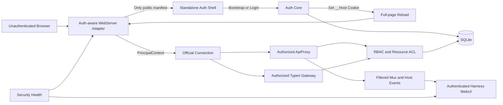

# 基于 dsh-webui-auth 的认证插件参考方案

> 目标项目：`ds-auths-plugin`
>
> 基础方案：[DEEPSEEK_HARNESS_AUTH_PLUGIN_PLAN.md](./DEEPSEEK_HARNESS_AUTH_PLUGIN_PLAN.md)
>
> 参考项目：<https://github.com/Yuuz12/dsh-webui-auth>
>
> 源码审查基线：`dsh-webui-auth` `0.2.3`，提交 `6adeb61e8db3c009b526dc3b9c5e73f3c69396bb`
>
> DeepSeek Harness 基线：`47f943859bef60e4160492346772ded9b24f765a`，版本 `0.1.0-rc.5`
>
> 更新日期：2026-08-17

## 1. 文档目的

本文不是用 `dsh-webui-auth` 替换原方案，而是在原有“独立 Bundle、无核心修改、WebServer Adapter、RBAC、ACL、审计”架构上，吸收该项目已经验证过的实用设计，并明确哪些实现不能原样采用。

核心结论如下：

- 保留原方案的 `webserver`、`api-gateway`、`typert-gateway` Adapter 替换策略。
- 借鉴独立登录页，但改为“认证前不加载 Harness WebUI、插件 Bundle 和业务数据”。
- 借鉴零原生依赖的 scrypt，实现可插拔 `PasswordHasher`，首版默认 scrypt，Argon2id 作为可选 Adapter。
- 借鉴服务器端 opaque session、HttpOnly Cookie、会话时长预设和改密吊销。
- 借鉴 DSH 主题同步、设置页集成、审计摘要和安全状态告警。
- 将其“核心补丁自检”改造为“只读兼容性与安全健康检查”，永不改写 `node_modules`。
- 不采用未初始化自动放行、删除凭据即可关闭认证、运行时核心补丁、单一全局限流和仅握手验证 WebSocket 的做法。

## 2. 参考项目的真实实现

`dsh-webui-auth` 是一个可通过 DSH Bundle 安装的 Host + Browser 双端插件。其 `cordis.patch.yml` 只插入自身插件行，Browser 入口通过 `dsh.client` 发布预构建的 `lib/client.js`。[S1][S2]

实际认证覆盖由四部分组成：

| 范围 | 实际实现 | 是否只靠标准插件 seam |
|---|---|---:|
| SPA fallback 与未匹配资源 | 注册 `prefix ''`，未登录时跳转独立登录页 | 是 |
| `/plugins/*` Browser Bundle | 启动时改写 `dsh-client-modules` 的 `serveBundle` | 否 |
| `/api` HTTP RPC | 启动时改写 `dsh-client-connection`，调用共享 gate | 否 |
| 两条事件 WebSocket | 启动时改写 `dsh-client-connection` 的 upgrade handler | 否 |

官方 WebServer 会先匹配 exact route，再选最长 prefix，最后才执行 fallback。因此，`prefix ''` 不能保护已由 `/api`、`/plugins` 或第三方 exact/prefix route 认领的请求；参考项目依靠三处核心包补丁补齐这些入口。[S3][S4][S5]

它的认证数据和运行状态如下：

| 项目 | 实现 |
|---|---|
| 用户模型 | 单一管理员用户名和密码 |
| 密码哈希 | Node 内置 scrypt，自描述参数，随机盐，恒定时间比较 |
| 会话 | 进程内 `Map`，随机 opaque token |
| Cookie | `HttpOnly; SameSite=Lax; Path=/`，可选 `Max-Age` |
| 会话时长 | 浏览器会话、1 小时、12 小时、1 天、3 天 |
| 吊销 | 改密时清除除当前 token 外的其他内存会话 |
| 持久化 | `dsh-webui-auth.json` 与 `audit.jsonl` |
| UI | 独立登录页 + `settings.section` 设置页 |
| 审计 | JSONL 追加，设置页最近记录和 CLI 查看 |
| 主题 | 登录页读取 DSH `ui-theme` 偏好，设置页直接使用 DSH CSS token |

## 3. 值得吸收的设计

### 3.1 认证前不启动完整 WebUI

参考项目提供完全自包含的独立登录页，登录页不依赖 Harness SPA、Browser 插件或 `/api`。这比“先公开整个 SPA，再用全屏 Overlay 遮住内容”更安全，也能避免认证前加载会话标题、插件清单、Source Map 或其他敏感资源。[S6]

对原方案的修订：

- 初次登录由 WebServer Adapter 直接服务最小认证壳。
- Harness `index.html`、官方 `/assets/*` 和 `/plugins/*` 默认全部要求认证。
- `shell.overlay` 继续用于登录后的会话过期、敏感操作重新认证和强制改密，不再承担首次访问的唯一门禁。
- 登录成功后执行整页 reload，随后才加载 Harness、Connection 和两条 WebSocket。

### 3.2 传输层全覆盖的安全意识

参考项目明确区分 SPA、插件 Bundle、RPC 和 WebSocket，说明作者没有把“显示一个登录表单”误认为安全边界。[S7]

本方案继续把门禁放到认证版 WebServer Adapter 内，但不再分散到三处核心补丁。所有 route 和 upgrade 都先经过同一个 `AccessGate`，再进入官方 exact/prefix/fallback 或 WebSocket owner。

### 3.3 scrypt 的即插即用价值

参考项目使用 Node 内置 `crypto.scrypt`，无原生模块、无安装脚本，哈希字符串包含 `N/r/p/salt/hash`，并在用户名不存在时执行等成本 dummy verify。[S8]

这非常适合“npm/GitHub/tarball 安装后直接可用”的插件目标。原方案改为：

```ts
interface PasswordHasher {
  hash(password: string): Promise<string>
  verify(password: string, encoded: string): Promise<boolean>
  needsRehash(encoded: string): boolean
}
```

首版提供：

| Adapter | 定位 |
|---|---|
| `scrypt-v1` | 默认；纯 Node、跨平台、零原生构建 |
| `argon2id-v1` | 可选；通过目标平台预构建与兼容测试后启用 |

哈希必须自描述，登录成功时可按 `needsRehash()` 无感升级。参数由启动基准确定并设置上下界，不能盲目信任数据库中恶意放大的 KDF 参数。

### 3.4 服务端 opaque session

参考项目不把 token 放入 `localStorage`，浏览器仅通过 HttpOnly Cookie 自动携带 token；这与官方同源 `fetch` 和原生 WebSocket 完全适配。[S9]

原方案继续使用服务器端会话，但强化如下：

- 生产 HTTPS 使用 `__Host-dsh_auth`，并强制 `Secure; Path=/`、不设置 `Domain`。
- 仅 loopback 明文 HTTP 开发模式使用无 `__Host-` 前缀的 `dsh_auth_dev`；非 loopback HTTP 直接拒绝登录。
- 数据库只保存 token 的 SHA-256 摘要，不保存原始 token。
- 同时维护 idle timeout 和 absolute timeout。
- 登录、提权、改密和角色变更后轮换或撤销会话。
- WebSocket 绑定 `sessionId`，撤销时主动关闭现有连接，而不只阻止下一次握手。

### 3.5 会话时长预设

参考项目提供清晰的浏览器会话、1 小时、12 小时、1 天和 3 天选项，用户易于理解。[S10]

管理台可沿用这些预设，但底层统一映射到 `idleTtl`、`absoluteTtl` 和 Cookie persistence：

| UI 预设 | idleTtl | absoluteTtl | Cookie |
|---|---:|---:|---|
| 关闭浏览器后失效 | 30 分钟滑动 | 12 小时 | Session Cookie |
| 高安全 | 30 分钟 | 1 小时 | Persistent |
| 标准 | 8 小时 | 12 小时 | Persistent |
| 一天 | 8 小时 | 24 小时 | Persistent |
| 三天 | 12 小时 | 72 小时 | Persistent |

### 3.6 主题同步与独立登录体验

参考项目从 DSH `ui-theme.preference` 读取 `light/dark/system`，登录页复刻系统主题跟随逻辑，设置页复用 DSH CSS token。[S6][S11]

本方案采用同一原则，但不复制整份官方 CSS：

- 认证壳只定义稳定的认证设计令牌，并从 DSH token 映射生成构建产物。
- `system` 使用 `prefers-color-scheme` 并实时响应变化。
- 支持 `prefers-reduced-motion`、键盘导航、焦点环、错误摘要和屏幕阅读器状态播报。
- 登录页保持独立可启动，同时加入品牌化双栏布局、细腻背景动效、安全状态提示和移动端响应式布局。

### 3.7 安全健康状态必须可见

参考项目会检测三处补丁是否存在，并在宿主日志和设置页显示黄色或红色告警。虽然“自动补丁”不可采用，但“安全能力异常不能静默失效”非常值得保留。[S12]

新增深模块：

```ts
interface SecurityHealth {
  snapshot(): Promise<SecurityHealthSnapshot>
  requireTrafficReady(): Promise<void>
}
```

健康项至少包括：

| 检查项 | 失败行为 |
|---|---|
| DSH 版本和 Adapter 契约 | 启动失败，不回退官方匿名 WebServer |
| WebServer/Auth Core/ApiProxy/Typert 装配 | 受保护流量返回 503 |
| 数据库迁移与可写性 | 进入 `DEGRADED_LOCKED` |
| Session 密钥和 Cookie 策略 | 拒绝登录或启动失败 |
| Legacy/Typert endpoint 策略覆盖 | 未分类 endpoint 默认拒绝 |
| Mux/Host 事件过滤器 | L2 模式禁止启动 |
| TLS/可信代理判断 | 管理台高危告警，生产策略可强制失败 |
| Bootstrap 状态 | 未初始化时保持锁定，只开放 bootstrap 路由 |

状态通过宿主日志、`/auth/v1/health/security` 和管理台安全横幅同时呈现。

### 3.8 审计的双入口

参考项目将安全事件写入 JSONL，既可在设置页查看最近记录，也可通过 CLI 查询。[S13]

本方案保留“UI + CLI”双入口，但数据进入 SQLite `audit_log`：

```bash
npx ds-auths-plugin audit tail --profile web --limit 50
npx ds-auths-plugin audit export --profile web --since 2026-08-01
```

管理台提供搜索、筛选、详情 Drawer、风险徽章和导出。CLI 用于 WebUI 不可用时排障和恢复。

### 3.9 预构建、无 prepare 的发布体验

参考项目直接发布 `index.js` 和 `lib/client.js`，无 `prepare`，因此 npm、GitHub 和 tarball 安装都不需要用户授权构建脚本。[S1]

`ds-auths-plugin` 应同样发布完整 `lib`，并把“从源码构建”与“安装使用”分离。npm 包不得在安装时编译、打补丁或下载二进制。

### 3.10 可写目录探测带来的启示

参考项目发现 pnpm store 可能只读，并回退到 `$DSH_HOME/dsh-webui-auth/`，这是实际部署中很有价值的兼容经验。[S14]

本方案不尝试写入插件目录，所有运行数据从一开始固定在：

```text
$DSH_HOME/auth/v1/
```

启动时验证目录 owner、权限、可写性、剩余空间和 SQLite WAL 能力，避免安装方式改变数据位置。

## 4. 不能原样采用的实现

| 参考实现 | 风险 | 本方案决策 |
|---|---|---|
| 启动时改写三个核心位置 | 违反无核心修改；升级脆弱；卸载有残留 | 使用 Bundle Patch 替换 Adapter |
| 自动重打后再重启一次 | 两次启动之间 `/api` 和 WS 未受保护 | 不写磁盘；契约不兼容直接 fail closed |
| 未配置凭据时 `checkRequest()` 全放行 | 新实例或文件丢失会匿名暴露 | `UNINITIALIZED_LOCKED`，仅 bootstrap token 可初始化 |
| 删除凭据文件即可关闭认证 | 有宿主文件权限者可无审计关闭门禁 | 本地恢复 CLI + 一次性 token；删除数据库导致锁定 |
| 公开 setup 无一次性凭据 | 远程访问者可能抢先成为管理员 | 启动时生成短期 bootstrap token，只存摘要 |
| `prefix ''` 门禁 | exact 和更长 prefix 先匹配，可绕过 | WebServer 分派前统一 AccessGate |
| 只在 WS 握手时认证 | 改密/禁用后已连接 socket 仍可存活 | 建立 session-socket 索引并主动关闭 |
| Cookie 不含 `Secure` | HTTPS 部署仍可能被非安全传输 | `Secure=auto/required`，生产默认 required |
| 无 Origin、Fetch Metadata、CSRF token | SameSite 不能覆盖所有状态变更风险 | 三层 CSRF 防护，OIDC callback 单独处理 |
| 请求体无限缓冲 | 可被大 body 消耗内存 | auth body 默认 64 KiB，超限 413 并断流 |
| 全局 1 分钟 5 次失败 | 一个攻击者可阻断全部用户；不能区分喷洒 | 账号、IP、账号+IP 三维 token bucket |
| 会话只在内存 | 重启全部退出，无法跨设备管理 | SQLite 默认；内存 Adapter 仅用于测试 |
| 明文 token 作为 Map key | 内存泄露会直接得到 bearer token | 进程与数据库均以 token 摘要索引 |
| 单用户模型 | 无角色、ACL、最小权限 | 保留原方案完整 RBAC/ACL |
| JSON 文件直接覆盖 | 并发、原子性、权限和迁移能力不足 | SQLite 事务、migration、WAL、`0600` |
| JSONL 原始 IP/UA 无限追加 | 隐私、磁盘增长和查询能力有限 | IP 脱敏/策略化保存、保留期、分页与归档 |
| 强制大小写数字特殊符号 | 可用性一般，不等于更强密码 | 12–128 长度、强度估计、泄露密码阻断 |
| 500 响应返回异常消息 | 可能泄露路径和内部实现 | 稳定错误码，详细信息仅日志和 requestId |
| Browser 源码未随仓库提供 | 构建不可审计、维护困难 | 提交 TypeScript/TSX 源码并可重复构建 |
| 无测试、CI、peer 兼容声明 | DSH 升级风险不可控 | 契约测试、E2E、版本矩阵、精确 peer range |

## 5. 融合后的目标架构



### 5.1 WebServer 门禁接口

```ts
interface AccessGate {
  classify(request: IncomingMessage): RequestClass
  authenticate(request: IncomingMessage): Promise<AuthResult>
  authorizeRoute(input: RouteAuthorizationInput): Promise<RouteDecision>
  bindSocket(input: SocketBindingInput): SocketBinding
}
```

复杂的 Cookie 解析、Session 校验、Origin、CSRF、Principal Context、审计和 socket 绑定全部隐藏在该深模块内。官方与第三方 route handler 不需要理解认证实现。

### 5.2 运行状态机

| 状态 | 对外行为 |
|---|---|
| `UNINITIALIZED_LOCKED` | 仅认证壳、bootstrap status/complete 和最小 live health 可访问 |
| `READY` | 按 public manifest、认证和 RBAC 正常分派 |
| `DEGRADED_LOCKED` | 登录与业务流量返回 503；安全健康页给出 requestId |
| `DISABLED_BY_CONFIG` | 只允许本地配置显式关闭并重启，不提供 WebUI 一键关闭 |

任何数据库文件缺失、迁移失败或 Adapter 契约异常都不能从 `READY` 自动变为匿名放行。

## 6. 修订后的公开路由策略

| 请求 | 未认证响应 |
|---|---|
| `GET /auth/login` | 200，独立认证壳，`no-store` |
| `GET /auth/assets/<content-hash>.*` | 200，仅认证壳静态资源 |
| `GET /auth/v1/bootstrap/status` | 200，只返回状态枚举和安全能力摘要 |
| `POST /auth/v1/bootstrap/complete` | 校验一次性 token、Origin、CSRF 和限速 |
| `POST /auth/v1/login` | 统一失败响应并限速 |
| OIDC start/callback | 仅已配置 Provider 的精确路径 |
| `/`、Harness `/assets/*` | 浏览器导航 302 到 `/auth/login`；资源请求 401 |
| `/plugins/*` | 401，不泄露插件是否存在 |
| `/api/*` | 401 JSON |
| `/api/events.mux`、`/api/events.host` | upgrade 前 403 并关闭 socket |
| 任意第三方 exact/prefix route | 默认 401；必须在 public manifest 显式登记才能公开 |
| 未识别 route | 认证前 404/401 策略固定，不通过差异枚举私有资源 |

Public manifest 是代码内静态声明与受控扩展接口，不允许插件通过任意字符串把整个 prefix 公开。

## 7. 登录与初始化体验

### 7.1 首次初始化

1. 插件首次启动进入 `UNINITIALIZED_LOCKED`。
2. 宿主终端打印短期 bootstrap URL 或一次性 token，数据库只存 token 摘要。
3. 用户访问 `/auth/login`，进入三步初始化向导。
4. 向导验证 bootstrap token、创建首个 `super_admin`、选择会话策略并展示恢复码。
5. 事务提交用户、角色、会话和审计后，状态切换为 `READY`。
6. 浏览器获得 HttpOnly Cookie，整页 reload 后才加载 Harness WebUI。

并发 bootstrap 请求依赖数据库唯一约束和事务锁，只有一个请求成功。

### 7.2 日常登录

- 双栏品牌布局，左侧产品价值与安全状态，右侧本地密码/OIDC 登录卡片。
- 支持密码显隐、Caps Lock 提示、加载态、限流倒计时和无障碍错误摘要。
- 登录错误统一为“用户名或密码错误”，不暴露账号存在性、禁用状态或 Provider 绑定。
- 登录成功后旋转 session id，记录认证方式、设备摘要和 requestId。
- `returnTo` 只接受站内相对路径，防止开放重定向。

### 7.3 恢复流程

不采用“删除凭据文件”。提供本地运维命令：

```bash
npx ds-auths-plugin recovery issue --profile web
npx ds-auths-plugin user reset-password --profile web --username admin
```

恢复操作要求本地数据目录权限，生成短期一次性 token，写入审计，并使目标用户全部会话和 WebSocket 失效。

## 8. 管理台融合设计

参考项目把认证配置和最近审计放入 `settings.section`，这一入口继续保留，但扩展为完整“访问控制”工作台。[S11]

| 页面 | 参考项目启发 | 融合后实现 |
|---|---|---|
| 安全概览 | 补丁异常横幅 | Adapter、数据库、Cookie、TLS、策略覆盖和事件过滤健康卡 |
| 我的账号 | 用户名、改密、TTL、退出 | 资料、Provider、改密、设备会话、退出全部设备 |
| 用户 | 单管理员配置 | 搜索、筛选、角色徽章、批量状态、详情 Drawer |
| 角色 | 无 | 权限矩阵、差异预览、内置角色保护 |
| 资源访问 | 无 | Workspace/Session ACL 树和继承来源 |
| 在线会话 | 会话时长 | 设备、最近活动、单个/批量撤销 |
| 审计 | 最近 8 条 | 图表、时间线、筛选、详情和 JSON/CSV 导出 |
| 安全设置 | 开关、TTL | Provider、KDF、TTL、限速、可信代理和 unknown endpoint 策略 |

UI 继续复用 DSH 主题 token，样式采用 CSS Modules 和共享 primitives。表格、状态徽章、确认 Modal、Drawer、筛选器、分页、图表和空状态只实现一次并数据驱动复用。

## 9. 包结构调整

```text
ds-auths-plugin/
├── package.json
├── cordis.patch.yml
├── scripts/
│   ├── build.mjs
│   ├── preview.mjs
│   └── verify-preview.mjs
├── src/
│   ├── index.ts
│   ├── webserver.ts
│   ├── api-proxy.ts
│   ├── typert-gateway.ts
│   ├── cli.ts
│   ├── auth-shell/
│   ├── auth/
│   │   ├── access-gate.ts
│   │   ├── password-hasher.ts
│   │   ├── session-manager.ts
│   │   └── bootstrap.ts
│   ├── health/
│   ├── policy/
│   ├── persistence/
│   ├── audit/
│   └── client/
├── tests/
└── lib/
```

`auth-shell` 是未认证时唯一可加载的前端产物；`client` 是登录后由 Harness Client Modules 加载的管理台产物。二者不得共享会把 Harness runtime 拉入 public bundle 的入口。

## 10. 发布与兼容策略

- npm 包包含预构建 Host、认证壳和 Browser 管理台，不含 `prepare`。
- 不在安装或启动时修改任何官方文件。
- Patch 仅替换已验证的 Adapter ID，并在 `--dump-config` 快照中断言结果。
- 精确声明支持的 DSH RC 范围，不依赖源码字符串 anchor。
- 启动时只读检查版本、导出和运行时契约；不兼容则进入 `DEGRADED_LOCKED`。
- npm、GitHub commit 和 tarball 三种安装路径运行同一组合测试。
- 认证数据始终位于 `$DSH_HOME/auth/v1`，卸载默认保留，显式 purge 才删除。

## 11. 增量实施顺序

| 阶段 | 吸收的参考能力 | 退出条件 |
|---|---|---|
| R0 | 预构建 Bundle、独立认证壳、主题同步 | 未登录不加载 Harness 资源 |
| R1 | scrypt Adapter、opaque session、TTL 预设 | HTTP 和两条 WS 全部受同一门禁保护 |
| R2 | Bootstrap token、恢复 CLI、SQLite | 删除/损坏数据只能锁定，不能匿名放行 |
| R3 | 安全健康中心、审计 UI/CLI | 任一安全模块异常均可见且 fail closed |
| R4 | RBAC、Legacy/Typert endpoint 策略 | 未分类 endpoint 默认拒绝 |
| R5 | Workspace/Session ACL 和事件过滤 | 双用户并发隔离测试通过 |
| R6 | OIDC、可信代理、企业资料补全 | Provider 威胁测试和兼容矩阵通过 |

参考项目适合作为 R0/R1 的交互与产品验证样本，但不能作为 R4/R5 的权限隔离实现基础。

## 12. 新增测试重点

在原方案测试计划之外，增加以下回归项：

- 未登录访问 `/` 时，响应中不出现 Harness boot manifest、会话标题或插件名。
- 未登录不能获取 `/plugins/<id>/client.js` 和 Source Map。
- 第三方 exact route、短 prefix、长 prefix 均先经过 AccessGate。
- public manifest 只允许精确声明，重复、宽泛或动态 prefix 注册失败。
- 未初始化、数据库删除、数据库只读、迁移失败全部进入锁定态。
- 两个并发 bootstrap 请求只能创建一个 `super_admin`。
- 改密、禁用用户、角色撤销和管理员踢出会立即关闭绑定 WebSocket。
- Cookie 在 HTTP/HTTPS、可信代理和错误代理配置下的 `Secure` 行为正确。
- Auth body 超过上限、慢速上传、畸形 JSON 和重复 Cookie 均安全拒绝。
- scrypt 参数越界、旧哈希迁移、dummy verify 和登录时重哈希通过时序与功能测试。
- 安全健康项异常同时出现在日志、接口和管理台，且不会静默匿名降级。
- npm、GitHub、tarball 和只读 pnpm store 安装路径不写模块目录。
- 认证壳的 light/dark/system、系统切换、reduced motion 和键盘流程通过 E2E。

## 13. 最终采用清单

| 参考能力 | 结论 |
|---|---|
| 标准 Bundle + 预构建 Host/Browser | 直接采用 |
| 独立登录页 | 采用并提升为唯一未认证前端 |
| DSH 主题同步 | 采用 |
| scrypt + dummy verify | 采用为默认 PasswordHasher Adapter |
| 服务器端 opaque session | 采用，改为 SQLite 摘要存储 |
| HttpOnly + SameSite Cookie | 采用，补 `__Host-`、Secure、CSRF |
| 会话 TTL 预设 | 采用并映射 idle/absolute TTL |
| 改密吊销其他会话 | 采用并主动关闭 WebSocket |
| 设置页认证入口 | 采用并扩展为访问控制管理台 |
| 审计 UI + CLI | 采用，底层改 SQLite |
| 安全异常双通道告警 | 采用，泛化为 SecurityHealth |
| pnpm store 只读兼容 | 吸收经验，固定写 `$DSH_HOME` |
| 核心包补丁和自动重打 | 拒绝 |
| 无凭据自动放行 | 拒绝 |
| 删除凭据关闭认证 | 拒绝 |
| 单用户、无 RBAC | 拒绝 |
| 仅握手验证 WebSocket | 拒绝 |
| 无 CSRF、Origin、body limit | 拒绝 |

## 14. 一手资料索引

- [S1] `dsh-webui-auth/package.json`：Bundle、Browser client、预构建发布文件。<https://github.com/Yuuz12/dsh-webui-auth/blob/6adeb61e8db3c009b526dc3b9c5e73f3c69396bb/package.json>
- [S2] `dsh-webui-auth/cordis.patch.yml`：只插入自身插件行。<https://github.com/Yuuz12/dsh-webui-auth/blob/6adeb61e8db3c009b526dc3b9c5e73f3c69396bb/cordis.patch.yml>
- [S3] 参考项目三处核心补丁声明：`index.js` L570-L690。<https://github.com/Yuuz12/dsh-webui-auth/blob/6adeb61e8db3c009b526dc3b9c5e73f3c69396bb/index.js#L570-L690>
- [S4] 官方 WebServer 先 route 后 fallback：`packages/host/webserver/src/index.ts` L148-L166、L241-L250。<https://github.com/deepseek-ai/deepseek-harness/blob/47f943859bef60e4160492346772ded9b24f765a/packages/host/webserver/src/index.ts#L148-L166>
- [S5] 官方 `/plugins` prefix 与 `serveBundle`：`packages/client/modules/src/index.ts` L240-L245、L421-L459。<https://github.com/deepseek-ai/deepseek-harness/blob/47f943859bef60e4160492346772ded9b24f765a/packages/client/modules/src/index.ts#L240-L245>
- [S6] 独立登录页、DSH 主题偏好与安全响应头：`index.js` L378-L566、L767-L789。<https://github.com/Yuuz12/dsh-webui-auth/blob/6adeb61e8db3c009b526dc3b9c5e73f3c69396bb/index.js#L378-L566>
- [S7] 传输覆盖说明与 gate：`index.js` L1-L35、L693-L751、L1093-L1121。<https://github.com/Yuuz12/dsh-webui-auth/blob/6adeb61e8db3c009b526dc3b9c5e73f3c69396bb/index.js#L693-L751>
- [S8] scrypt、自描述哈希、恒定时间与 dummy verify：`index.js` L64-L125。<https://github.com/Yuuz12/dsh-webui-auth/blob/6adeb61e8db3c009b526dc3b9c5e73f3c69396bb/index.js#L64-L125>
- [S9] Cookie 与内存会话：`index.js` L364-L376、L712-L746。<https://github.com/Yuuz12/dsh-webui-auth/blob/6adeb61e8db3c009b526dc3b9c5e73f3c69396bb/index.js#L712-L746>
- [S10] TTL 选项与设置页选择器：`index.js` L302-L310；`lib/client.js` L273-L290。<https://github.com/Yuuz12/dsh-webui-auth/blob/6adeb61e8db3c009b526dc3b9c5e73f3c69396bb/index.js#L302-L310>
- [S11] Browser 设置页、DSH token 和审计摘要：`lib/client.js` L8-L38、L63-L326。<https://github.com/Yuuz12/dsh-webui-auth/blob/6adeb61e8db3c009b526dc3b9c5e73f3c69396bb/lib/client.js#L63-L326>
- [S12] 补丁检查、自动恢复和 UI 告警：`index.js` L570-L699；`lib/client.js` L211-L243。<https://github.com/Yuuz12/dsh-webui-auth/blob/6adeb61e8db3c009b526dc3b9c5e73f3c69396bb/index.js#L570-L699>
- [S13] JSONL 审计与 CLI：`index.js` L230-L300、L1124-L1192。<https://github.com/Yuuz12/dsh-webui-auth/blob/6adeb61e8db3c009b526dc3b9c5e73f3c69396bb/index.js#L230-L300>
- [S14] 只读模块目录与 `$DSH_HOME` 回退：`index.js` L128-L184。<https://github.com/Yuuz12/dsh-webui-auth/blob/6adeb61e8db3c009b526dc3b9c5e73f3c69396bb/index.js#L128-L184>

## 15. 定案

`dsh-webui-auth` 最有价值的不是其核心补丁方式，而是它证明了三件事：独立登录页可以与 DSH 主题自然融合；同源 HttpOnly Cookie 可以同时适配 fetch 和 WebSocket；安全状态、会话策略与审计可以作为 Harness 设置体验的一部分。

融合后的 `ds-auths-plugin` 应保留这些产品与运维优点，同时把认证门禁收敛到 WebServer Adapter，把身份与权限收敛到 Principal/Policy 深模块，把持久化收敛到 SQLite，并对所有异常坚持 fail closed。这样既保留参考项目的轻量、易安装和易理解，也满足原方案对 RBAC、ACL、事件隔离、升级兼容和无残留卸载的要求。
